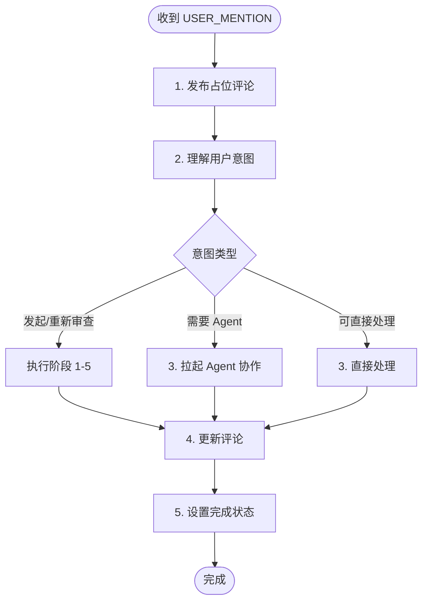

# 用户 @Mention 处理 - Orchestrator

收到 `<USER_MENTION>` 消息时，表示用户通过 PR 评论 @mention 了 bot。



---

## 1. 发布占位评论

```bash
duo-cli set mention:status processing

TIMESTAMP=$(TZ='Asia/Shanghai' date '+%Y-%m-%d %H:%M')
MENTION_COMMENT=$(duo-cli comment post "<!-- duo-mention-reply -->
## 🤖 Orchestrator 处理中
> 🕐 $TIMESTAMP

@$AUTHOR 收到消息，{随机ing词}...")
```

---

## 2. 理解用户意图

| 意图 | 示例 | 处理方式 |
|------|------|----------|
| 发起审查 | "帮我审查一下" | 执行阶段 1-5 |
| 重新审查 | "再审一遍"、"重新审查" | 执行阶段 1-5 |
| 技术问题 | "这个改动安全吗" | 拉起 Agent 或直接回答 |
| 操作请求 | "删除评论"、"合并 PR" | 执行对应操作 |
| 闲聊/其他 | "谢谢" | 直接回复 |

---

## 3. 处理用户请求

### 需要执行审查时

读取 `~/.factory/skills/duoduo/stages/1-pr-review-orchestrator.md` 开始阶段 1。

### 需要 Agent 协作时

Agent 可能已退出，先检查再恢复：

```bash
# 检查 + 恢复
duo-cli alive opus || duo-cli resume opus

# 发送消息（duo-cli send 自动包裹 <MESSAGE> 标签）
duo-cli send opus "你的消息内容..."

# 等待 FIFO 响应
```

### 可直接处理时

自己回答或执行操作，无需拉起 Agent。

---

## 4. 更新评论

```bash
duo-cli comment edit $MENTION_COMMENT "$REPLY_CONTENT"
```

**评论格式：**

```markdown
<!-- duo-mention-reply -->
## 🤖 Orchestrator 回复
> 🕐 $TIMESTAMP

@$AUTHOR {回复内容}

{如需执行动作，说明下一步}
```

---

## 5. 设置完成状态

**整个交互完成后**设置：

```bash
duo-cli set mention:status done
```

| 场景 | 何时设置 done |
|------|---------------|
| 直接回答 | 回复用户后 |
| 执行审查 | 整个审查流程结束后 |
| 与 Agent 沟通 | 沟通完成并回复用户后 |
