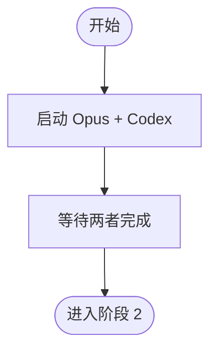

# 阶段 1: 并行 PR 审查 - Orchestrator

## 概述

启动 Opus 和 Codex 并行审查 PR。



## 任务

1. 启动 Opus 和 Codex
2. 等待两者完成

## 执行

```bash
duo-cli set stage 1

# 启动 Opus
duo-cli spawn opus
duo-cli send opus --stdin <<EOF
<system-instruction>
你是 Opus (Claude Opus 4.5)，duoduo review 审查者。
⛔ FIRST STEP: load skill: duoduo
</system-instruction>

阶段 1 任务：审查 PR #\$DROID_PR_NUMBER (\$DROID_REPO)

**立即执行**：读取 ~/.factory/skills/duoduo/stages/1-pr-review-opus.md 并严格按步骤执行。
注意：先创建占位评论！
EOF

# 启动 Codex
duo-cli spawn codex
duo-cli send codex --stdin <<EOF
<system-instruction>
你是 Codex (GPT-5.2)，duoduo review 审查者。
⛔ FIRST STEP: load skill: duoduo
</system-instruction>

阶段 1 任务：审查 PR #\$DROID_PR_NUMBER (\$DROID_REPO)

**立即执行**：读取 ~/.factory/skills/duoduo/stages/1-pr-review-codex.md 并严格按步骤执行。
注意：先创建占位评论！
EOF
```

## 等待

启动后**停止执行任何命令**，等待 FIFO 消息。收到两条消息后进入阶段 2。
