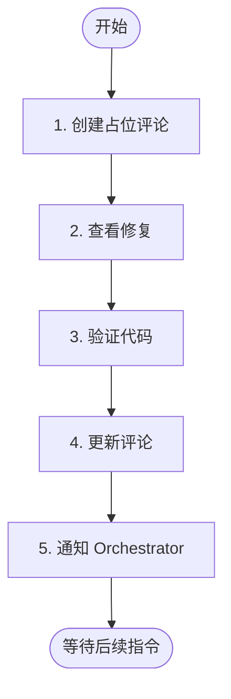

# 阶段 4: 验证 - Codex

验证 Opus 的修复是否正确。



---

## 1. 创建占位评论

```bash
TIMESTAMP=$(TZ='Asia/Shanghai' date '+%Y-%m-%d %H:%M')

COMMENT_ID=$(duo-cli comment post --stdin <<EOF
<!-- duo-codex-verify -->
##  Codex 验证中
> 🕐 $TIMESTAMP

 {随机ing词}...
EOF
)
```

**{随机 ing 词}**: Verifying, Inspecting, Checking 等，自己想一个有趣的！

---

## 2. 查看修复

```bash
git diff origin/$DROID_BASE..HEAD
```

---

## 3. 验证代码

检查：

- 问题是否真正解决
- 是否引入新问题
- 代码质量是否符合规范

---

## 4. 更新评论

```bash
duo-cli comment edit $COMMENT_ID "$VERIFY_CONTENT"
```

**评论格式：**

```markdown
<!-- duo-codex-verify -->
##  Codex 验证完成
> 🕐 {TIMESTAMP}

### 验证结果
✅ 通过 / ❌ 失败

### 说明
（如果失败，说明原因）
```

---

## 5. 通知 Orchestrator

```bash
duo-cli send orchestrator "验证通过/失败: 原因"
```
