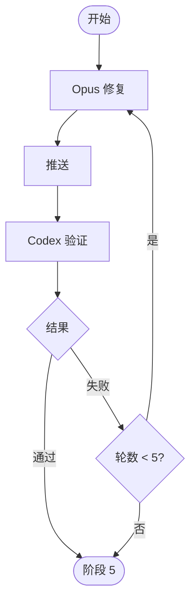

# 阶段 4: 修复验证 - Orchestrator

## 概述

协调 Opus 修复和 Codex 验证，最多 5 轮。



## 任务

协调 Opus 修复和 Codex 验证，最多 5 轮。

## 执行

```bash
duo-cli set stage 4
duo-cli set s4:round 1

# 通知 Opus 修复
duo-cli send opus --stdin <<EOF
阶段 4 任务：修复问题。Round $(duo-cli get s4:round)。

需修复的问题：
$FIX_ISSUES

阅读 ~/.factory/skills/duoduo/stages/4-fix-verify-opus.md 执行。
EOF
```

## 等待

Opus 修复完成后会直接通知 Codex 验证，Codex 验证完成后会通知 Orchestrator。

## 处理结果

- 通过 → 阶段 5
- 失败 + 轮数 < 5 → 增加轮数，继续
- 失败 + 轮数 >= 5 → 阶段 5（标记修复未完成）
