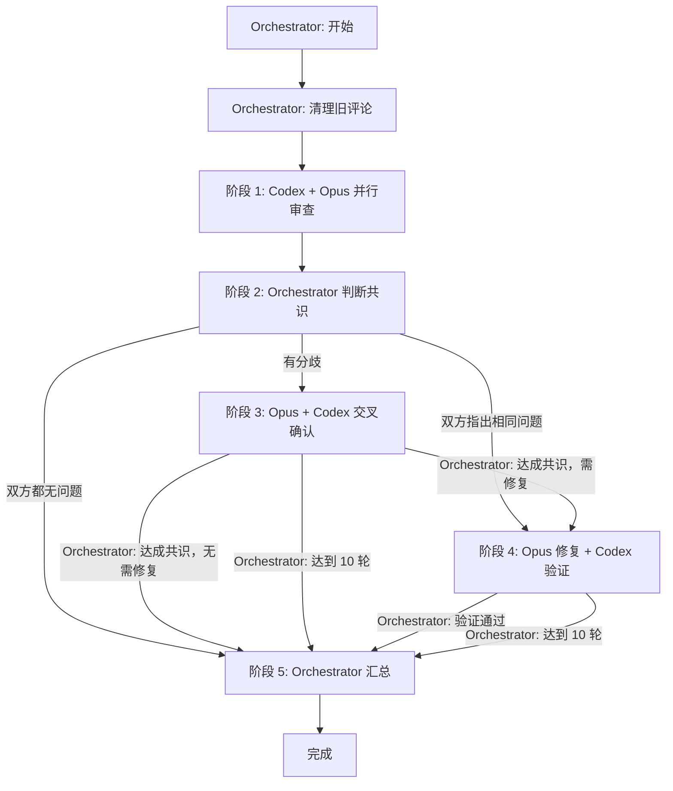

# Duo Review - 双 Agent 交叉审查

## 角色

| 角色             | 模型                | 职责                           |
| ---------------- | ------------------- | ------------------------------ |
| **Orchestrator** | 执行 skill 的 droid | 编排流程、判断共识、决定下一步 |
| **Codex**        | GPT-5.1 Codex Max   | PR 审查、交叉确认、验证修复    |
| **Opus**         | Claude Opus 4.5     | PR 审查、交叉确认、执行修复    |

**⚠️ 重要：Orchestrator 不要读 PR diff、REVIEW.md 或任何代码文件！这是 Codex/Opus 的工作。Orchestrator 只负责：**
1. **执行脚本**（清理评论、创建评论、启动 Codex/Opus）
2. **等待和判断**（读取评论结果、判断共识）
3. **立即启动**（准备工作完成后立即并行启动 Codex/Opus，不要先读 diff）

## 输入

- `PR_NUMBER`: PR 编号
- `PR_BRANCH`: PR 分支名
- `BASE_BRANCH`: 目标分支
- `REPO`: 仓库名（格式 owner/repo）

## 可用脚本

| 脚本 | 用途 | 用法 |
|------|------|------|
| `scripts/cleanup-comments.sh` | 清理所有 duo 评论 | `cleanup-comments.sh <PR_NUMBER> <REPO>` |
| `scripts/post-comment.sh` | 发布评论，返回 ID | `post-comment.sh <PR_NUMBER> <REPO> "<BODY>"` |
| `scripts/edit-comment.sh` | 编辑评论（stdin） | `echo "<BODY>" \| edit-comment.sh <COMMENT_ID>` |
| `scripts/codex-exec.sh` | 启动 Codex | `codex-exec.sh "<PROMPT>"` |
| `scripts/opus-exec.sh` | 启动 Opus | `opus-exec.sh "<PROMPT>"` |
| `scripts/codex-resume.sh` | 恢复 Codex 会话 | `codex-resume.sh <SESSION_ID> "<PROMPT>"` |
| `scripts/opus-resume.sh` | 恢复 Opus 会话 | `opus-resume.sh <SESSION_ID> "<PROMPT>"` |
| `scripts/get-time.sh` | 获取新加坡时间 | `get-time.sh` |

## 准备工作

### 1. 清理所有旧评论

**必须调用脚本，不要自己写删除逻辑**：

```bash
scripts/cleanup-comments.sh $PR_NUMBER $REPO
```

### 2. 创建进度评论

```bash
PROGRESS_COMMENT_ID=$(scripts/post-comment.sh $PR_NUMBER $REPO "<!-- duo-review-progress -->
正在审查 PR #$PR_NUMBER... 
")
```

### 3. 创建 Codex/Opus 占位评论

```bash
CODEX_COMMENT_ID=$(scripts/post-comment.sh $PR_NUMBER $REPO "<!-- duo-codex-r1 -->
 **Codex** 审查中...
")

OPUS_COMMENT_ID=$(scripts/post-comment.sh $PR_NUMBER $REPO "<!-- duo-opus-r1 -->
 **Opus** 审查中...
")
```

**流程结束后编辑进度评论为汇总内容**。

### 图标

- Codex: ``
- Opus: ``
- Loading (Orchestrator 进度): ``

## 五阶段流程



## 阶段详情

| 阶段 | 文件                          | 执行者                      | 说明                                     |
| ---- | ----------------------------- | --------------------------- | ---------------------------------------- |
| 1    | `stages/1-pr-review.md`       | Codex + Opus                | 并行审查，输出 SESSION_ID, RESULT        |
| 2    | `stages/2-judge-consensus.md` | Orchestrator                | 根据 RESULT 判断共识                     |
| 3    | `stages/3-cross-confirm.md`   | Opus + Codex + Orchestrator | 交叉确认，Orchestrator 判断共识          |
| 4    | `stages/4-fix-verify.md`      | Opus + Codex + Orchestrator | Opus 修复，Codex 验证，Orchestrator 判断 |
| 5    | `stages/5-summary.md`         | Orchestrator                | 编辑进度评论为汇总                       |

## 标记

- `<!-- duo-review-progress -->`: 进度/汇总评论
- `<!-- duo-codex-r{N} -->` / `<!-- duo-opus-r{N} -->`: Codex/Opus 评论

## 成功标准

- [x] R1 评论发布
- [x] 达成共识或达到最大轮数
- [x] 如需修复，验证通过或达到最大轮数
- [x] 进度评论编辑为汇总

## 参考

- 审查规范: `REVIEW.md`
- 原子脚本: `scripts/`
