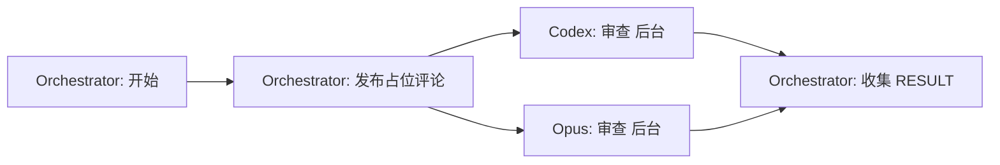

# 阶段 1: 并行 PR 审查

**执行者**: Orchestrator + Codex + Opus



## 步骤 1: Orchestrator 发布占位评论

```bash
# Codex 占位评论
CODEX_COMMENT_ID=$(scripts/post-comment.sh $PR_NUMBER $REPO "...")

# Opus 占位评论
OPUS_COMMENT_ID=$(scripts/post-comment.sh $PR_NUMBER $REPO "...")
```

## 步骤 2: 并行启动审查

**使用 Execute 工具的 `fireAndForget: true` 参数并行启动**：

```json
// 启动 Codex（后台）
Execute({ command: "scripts/codex-exec.sh '...'", fireAndForget: true })
// 返回: PID 和日志文件路径

// 启动 Opus（后台）
Execute({ command: "scripts/opus-exec.sh '...'", fireAndForget: true })
// 返回: PID 和日志文件路径
```

## 步骤 3: 等待并检查评论

等待 60-90 秒后，检查 PR 评论是否已更新（Codex/Opus 会直接编辑占位评论）：

```bash
gh pr view $PR_NUMBER --repo $REPO --json comments -q '.comments[] | select(.body | contains("duo-codex-r1")) | .body'
```

## Codex 审查 prompt

```plain
你是 Codex，负责审查 PR #$PR_NUMBER。

## 准备工作
1. 阅读 REVIEW.md 了解审查规范
2. 运行 gh pr diff $PR_NUMBER --repo $REPO 查看变更

## 输出
用 scripts/edit-comment.sh $CODEX_COMMENT_ID "评论内容" 编辑评论。

评论内容格式：
<!-- duo-codex-r1 -->
##  Round 1 | GPT-5.1 Codex Max | ✅ PR
> 🕐 审查时间：(scripts/get-time.sh)

(审查内容)

✅ 未发现问题 或 🔴[P0] 🟠[P1] 🟡[P2] 🟢[P3]
```

## Opus 审查 prompt

```plain
你是 Opus，负责审查 PR #$PR_NUMBER。

## 准备工作
1. 阅读 REVIEW.md 了解审查规范
2. 运行 gh pr diff $PR_NUMBER --repo $REPO 查看变更

## 输出
用 scripts/edit-comment.sh $OPUS_COMMENT_ID "评论内容" 编辑评论。

评论内容格式：
<!-- duo-opus-r1 -->
##  Round 1 | Opus 4.5 | ✅ PR
> 🕐 审查时间：(scripts/get-time.sh)

(审查内容)

✅ 未发现问题 或 🔴[P0] 🟠[P1] 🟡[P2] 🟢[P3]
```

## 输出

| 变量 | 说明 |
|------|------|
| `CODEX_SESSION_ID` | Codex 会话 ID |
| `OPUS_SESSION_ID` | Opus 会话 ID |
| `CODEX_COMMENT_ID` | Codex 评论 ID |
| `OPUS_COMMENT_ID` | Opus 评论 ID |
| `CODEX_RESULT` | Codex 审查结果 |
| `OPUS_RESULT` | Opus 审查结果 |
