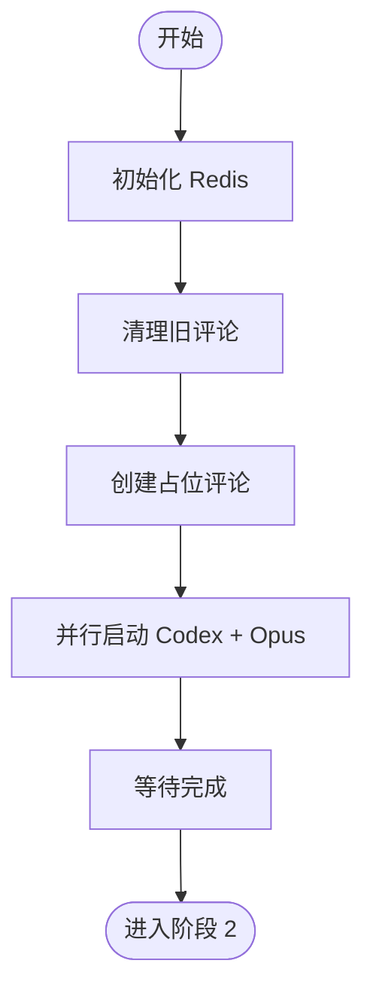

# 阶段 1: 并行 PR 审查

**执行者**: Orchestrator + Codex + Opus

## 流程图



## ⚠️ 重要规则

1. **禁止读取 diff** - 直接执行脚本，不要先看 PR 内容
2. **必须并行启动** - 使用 `fireAndForget: true` 同时启动 Codex 和 Opus

## 1.1 初始化 Redis

```bash
$S/duo-init.sh $PR_NUMBER $REPO $PR_BRANCH $BASE_BRANCH
```

## 1.2 清理旧评论

```bash
$S/cleanup-comments.sh $PR_NUMBER $REPO
```

## 1.3 创建占位评论

```bash
OPUS_COMMENT=$($S/post-comment.sh $PR_NUMBER $REPO "<!-- duo-opus-r1 -->
 **Opus** 审查中 ...")

CODEX_COMMENT=$($S/post-comment.sh $PR_NUMBER $REPO "<!-- duo-codex-r1 -->
 **Codex** 审查中 ...")

$S/duo-set.sh $PR_NUMBER s1:codex:review_node_id "$CODEX_COMMENT"
$S/duo-set.sh $PR_NUMBER s1:opus:review_node_id "$OPUS_COMMENT"
```

## 1.4 并行启动审查

**⚠️ 必须使用 `fireAndForget: true`！**

### 启动 Opus

```bash
$S/opus-exec.sh PR_NUMBER=$PR_NUMBER REPO=$REPO OPUS_COMMENT_ID=$OPUS_COMMENT BASE_BRANCH=$BASE_BRANCH
```

### 启动 Codex

```bash
$S/codex-exec.sh PR_NUMBER=$PR_NUMBER REPO=$REPO CODEX_COMMENT_ID=$CODEX_COMMENT BASE_BRANCH=$BASE_BRANCH
```

## 1.5 等待完成

```bash
$S/duo-wait.sh $PR_NUMBER s1:codex:status done s1:opus:status done
```

## 输出

完成后 Redis 中有：

- `s1:codex:status = done`
- `s1:codex:session = <UUID>`
- `s1:codex:conclusion = ok | p0 | p1 | p2 | p3`
- `s1:opus:*` 同上

→ 进入阶段 2
