# 阶段 1: 并行 PR 审查

**执行者**: Orchestrator + Codex + Opus

## 流程图

```mermaid
flowchart TD
    Start([开始]) --> Init[初始化 Redis]
    Init --> Clean[清理旧评论]
    Clean --> Create[创建占位评论]
    Create --> Launch[并行启动 Codex + Opus]
    Launch --> Wait[等待完成]
    Wait --> Done([进入阶段 2])
```



## ⚠️ 重要规则

1. **禁止读取 diff** - 直接执行脚本，不要先看 PR 内容
2. **必须并行启动** - 使用 `fireAndForget: true` 同时启动 Codex 和 Opus

## 1.1 初始化 Redis

```bash
$S/duo-init.sh $PR_NUMBER $REPO $PR_BRANCH $BASE_BRANCH
```

## 1.2 清理旧评论

```bash
$S/cleanup-comments.sh $PR_NUMBER $REPO
```

## 1.3 创建占位评论

```bash
OPUS_COMMENT=$($S/post-comment.sh $PR_NUMBER $REPO "<!-- duo-opus-r1 -->
 **Opus** 审查中 ...")

CODEX_COMMENT=$($S/post-comment.sh $PR_NUMBER $REPO "<!-- duo-codex-r1 -->
 **Codex** 审查中 ...")

$S/duo-set.sh $PR_NUMBER s1:codex:comment "$CODEX_COMMENT"
$S/duo-set.sh $PR_NUMBER s1:opus:comment "$OPUS_COMMENT"
```

## 1.4 并行启动审查

**⚠️ 必须使用 `fireAndForget: true`！**

### 启动 Opus

```bash
$S/opus-exec.sh $PR_NUMBER "You are reviewing PR #$PR_NUMBER ($REPO).

## Steps
1. Read REVIEW.md for project conventions
2. Run: gh pr diff $PR_NUMBER --repo $REPO
3. Post review: \$S/edit-comment.sh $OPUS_COMMENT "你的评论内容"

### How Many Findings to Return
Output all findings that the original author would fix if they knew about it. If there is no finding that a person would definitely love to see and fix, prefer outputting no findings. Do not stop at the first qualifying finding. Continue until you've listed every qualifying finding.

### Key Guidelines for Bug Detection
Only flag an issue as a bug if:
1. It meaningfully impacts the accuracy, performance, security, or maintainability of the code.
2. The bug is discrete and actionable (not a general issue).
3. Fixing the bug does not demand a level of rigor not present in the rest of the codebase.
4. The bug was introduced in the commit (pre-existing bugs should not be flagged).
5. The author would likely fix the issue if made aware of it.
6. The bug does not rely on unstated assumptions.
7. Must identify provably affected code parts (not speculation).
8. The bug is clearly not intentional.

### Comment Guidelines
Your review comments should be:
1. Clear about why the issue is a bug
2. Appropriately communicate severity
3. Brief - at most 1 paragraph
4. Code chunks max 3 lines, wrapped in markdown
5. Clearly communicate scenarios/environments for bug
6. Matter-of-fact tone without being accusatory
7. Immediately graspable by original author
8. Avoid excessive flattery
- Ignore trivial style unless it obscures meaning or violates documented standards.

### Priority Levels
- 🔴 [P0] - Drop everything to fix. Blocking release/operations
- 🟠 [P1] - Urgent. Should be addressed in next cycle
- 🟡 [P2] - Normal. To be fixed eventually
- 🟢 [P3] - Low. Nice to have

## IMPORTANT: Output Format (MUST follow exactly)
<!-- duo-opus-r1 -->
##  Opus | PR #$PR_NUMBER
> 🕐 \$(TZ='Asia/Shanghai' date '+%Y-%m-%d %H:%M') (GMT+8)

### Findings
(No issues found OR list by priority)

### Conclusion
✅ No issues OR highest priority found"
```

### 启动 Codex

```bash
$S/codex-exec.sh $PR_NUMBER "You are reviewing PR #$PR_NUMBER ($REPO).

## Steps
1. Read REVIEW.md for project conventions
2. Run: gh pr diff $PR_NUMBER --repo $REPO
3. Post review: \$S/edit-comment.sh $CODEX_COMMENT "你的评论内容"

### How Many Findings to Return
Output all findings that the original author would fix if they knew about it. If there is no finding that a person would definitely love to see and fix, prefer outputting no findings. Do not stop at the first qualifying finding. Continue until you've listed every qualifying finding.

### Key Guidelines for Bug Detection
Only flag an issue as a bug if:
1. It meaningfully impacts the accuracy, performance, security, or maintainability of the code.
2. The bug is discrete and actionable (not a general issue).
3. Fixing the bug does not demand a level of rigor not present in the rest of the codebase.
4. The bug was introduced in the commit (pre-existing bugs should not be flagged).
5. The author would likely fix the issue if made aware of it.
6. The bug does not rely on unstated assumptions.
7. Must identify provably affected code parts (not speculation).
8. The bug is clearly not intentional.

### Comment Guidelines
Your review comments should be:
1. Clear about why the issue is a bug
2. Appropriately communicate severity
3. Brief - at most 1 paragraph
4. Code chunks max 3 lines, wrapped in markdown
5. Clearly communicate scenarios/environments for bug
6. Matter-of-fact tone without being accusatory
7. Immediately graspable by original author
8. Avoid excessive flattery
- Ignore trivial style unless it obscures meaning or violates documented standards.

### Priority Levels
- 🔴 [P0] - Drop everything to fix. Blocking release/operations
- 🟠 [P1] - Urgent. Should be addressed in next cycle
- 🟡 [P2] - Normal. To be fixed eventually
- 🟢 [P3] - Low. Nice to have

## IMPORTANT: Output Format (MUST follow exactly)
<!-- duo-codex-r1 -->
##  Codex | PR #$PR_NUMBER
> 🕐 \$(TZ='Asia/Shanghai' date '+%Y-%m-%d %H:%M') (GMT+8)

### Findings
(No issues found OR list by priority)

### Conclusion
✅ No issues OR highest priority found"
```

## 1.5 等待完成

```bash
$S/duo-wait.sh $PR_NUMBER s1:codex:status done s1:opus:status done
```

## 输出

完成后 Redis 中有：

- `s1:codex:status = done`
- `s1:codex:session = <UUID>`
- `s1:codex:conclusion = ok | p0 | p1 | p2 | p3`
- `s1:opus:*` 同上

→ 进入阶段 2
