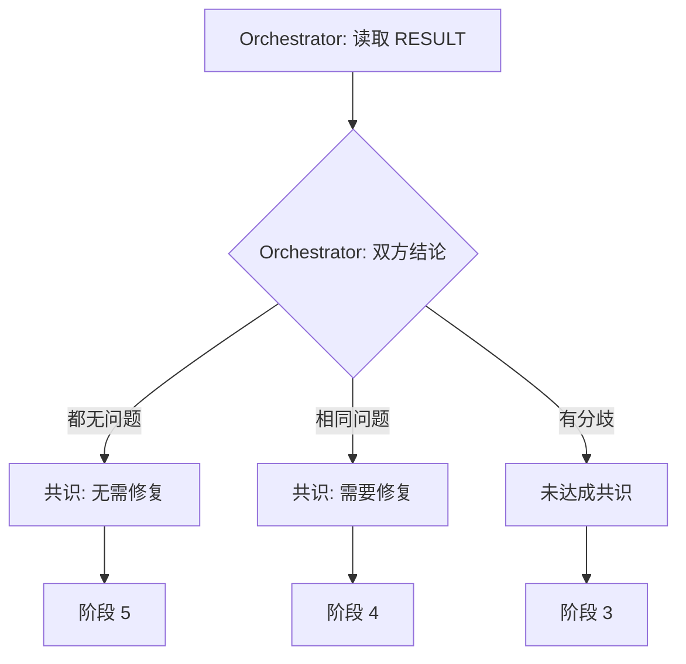

# 阶段 2: 判断 R1 共识

**执行者**: Orchestrator

根据阶段 1 的输出 `CODEX_RESULT` 和 `OPUS_RESULT`，Orchestrator 自行判断下一步。

## 决策逻辑

| CODEX_RESULT | OPUS_RESULT | 判断 | 下一步   |
| ------------ | ----------- | ---- | -------- |
| 未发现问题   | 未发现问题  | 共识 | → 阶段 5 |
| 问题 A       | 问题 A      | 共识 | → 阶段 4 |
| 未发现问题   | 问题 A      | 分歧 | → 阶段 3 |
| 问题 A       | 未发现问题  | 分歧 | → 阶段 3 |
| 问题 A       | 问题 B      | 分歧 | → 阶段 3 |

无需额外命令，Orchestrator 直接根据结果决策。
