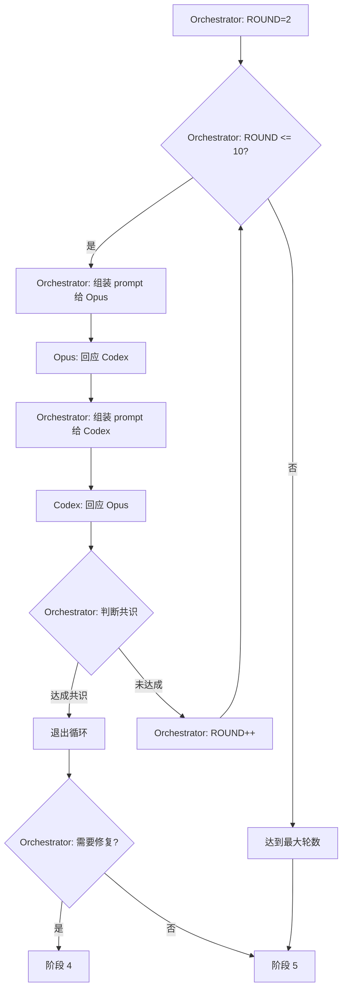

# 阶段 3: 交叉确认（最多 10 轮）

**执行者**: Orchestrator + Opus + Codex



## 步骤 0: Orchestrator 初始化

```bash
ROUND=2
```

## 步骤 1: Orchestrator 组装 prompt 给 Opus

Orchestrator 已知 CODEX_RESULT，组装 prompt：

```plain
scripts/opus-resume.sh $OPUS_SESSION_ID "
## Codex 的审查结论
$CODEX_RESULT

## 回应规则
- 如果 Codex 说「未发现问题」且你也同意，回复：✅ 同意，无需修复
- 如果 Codex 指出问题，逐个评估：
  - ✅ 认可 - 问题确实存在
  - ❌ 不认可 - 说明为什么是误报
- 如果是后续轮次，回应 Codex 对你的质疑

## 输出
用 gh pr comment $PR_NUMBER --repo $REPO 发布回应。

评论格式：
<!-- duo-opus-r{ROUND} -->
> (引用 Codex 原文：复制粘贴你要回应的具体内容，不要总结)

##  Round {ROUND} | Opus 4.5 | ✅ PR → ⏳ Cross
> 🕐 时间：(scripts/get-time.sh)

(你的回应内容，用表格列出判断)
"
```

## 步骤 2: Orchestrator 组装 prompt 给 Codex

Orchestrator 已知 OPUS_RESULT，组装 prompt：

```plain
scripts/codex-resume.sh $CODEX_SESSION_ID "
## Opus 的审查结论
$OPUS_RESULT

## 回应规则
- 如果 Opus 说「未发现问题」且你也同意，回复：✅ 同意，无需修复
- 如果 Opus 指出问题，逐个评估：
  - ✅ 认可 - 问题确实存在
  - ❌ 不认可 - 说明为什么是误报
- 如果是后续轮次，回应 Opus 对你的质疑

## 输出
用 gh pr comment $PR_NUMBER --repo $REPO 发布回应。

评论格式：
<!-- duo-codex-r{ROUND} -->
> (引用 Opus 原文：复制粘贴你要回应的具体内容)

##  Round {ROUND} | GPT-5.1 Codex Max | ✅ PR → ⏳ Cross
> 🕐 时间：(scripts/get-time.sh)

(你的回应内容，用表格列出判断)
"
```

## 步骤 3: Orchestrator 判断共识

Orchestrator 读取 OPUS_RESULT 和 CODEX_RESULT，自行判断：

1. 双方都同意"无需修复" → 共识，无需修复，进入阶段 5
2. 双方都认可某个具体问题 → 共识，需修复，进入阶段 4
3. 仍有 ❌ 分歧 → ROUND++，回到步骤 1

## 输出

- `CONSENSUS`: true/false
- `NEED_FIX`: true/false
- 下一阶段：4（需修复）/ 5（无需修复或达最大轮数）
