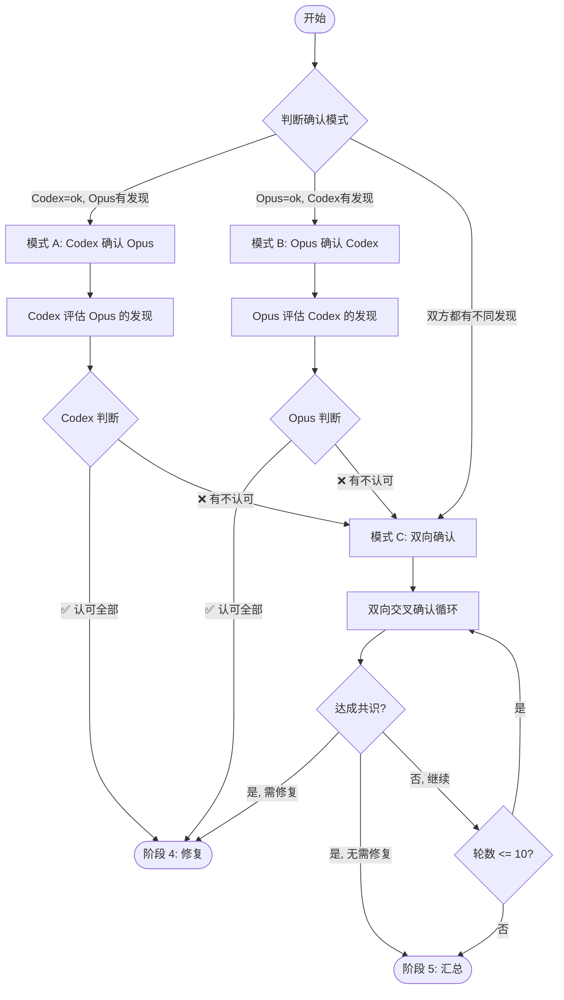
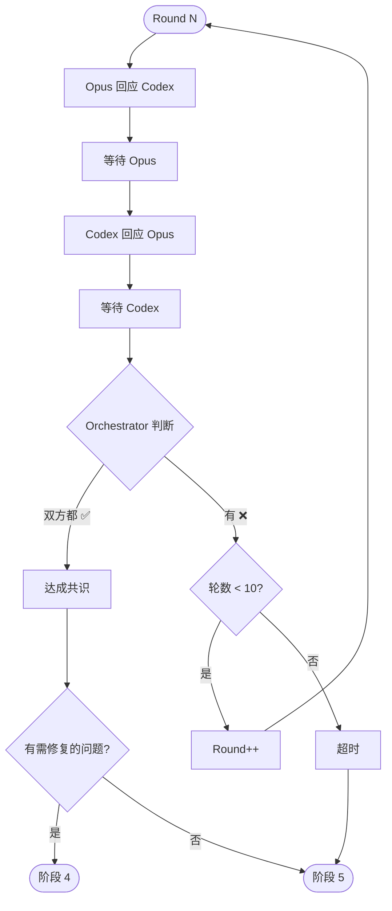

# 阶段 3: 交叉确认

**执行者**: Orchestrator + Codex/Opus

## 流程图



## 3.1 初始化

```bash
$S/duo-set.sh $PR_NUMBER stage 3
CODEX=$($S/duo-get.sh $PR_NUMBER s1:codex:conclusion)
OPUS=$($S/duo-get.sh $PR_NUMBER s1:opus:conclusion)

# 判断确认模式
if [ "$CODEX" = "ok" ]; then
  MODE="codex_confirm"  # Codex 没发现，需确认 Opus 的发现
elif [ "$OPUS" = "ok" ]; then
  MODE="opus_confirm"   # Opus 没发现，需确认 Codex 的发现
else
  MODE="bidirectional"  # 双方都有发现，需双向确认
fi

$S/duo-set.sh $PR_NUMBER s3:mode $MODE
$S/duo-set.sh $PR_NUMBER s3:round 1
```

---

## 模式 A: Codex 确认 Opus（单向）

当 `MODE = codex_confirm`：Codex 说 ok，但 Opus 发现了问题。

### A.1 Orchestrator 读取 Opus 评论

```bash
OPUS_COMMENT_ID=$($S/duo-get.sh $PR_NUMBER s1:opus:comment | head -1)
OPUS_FINDINGS=$(gh api /repos/$REPO/issues/comments/${OPUS_COMMENT_ID#*IC_} --jq '.body')
```

### A.2 让 Codex 评估

```bash
CODEX_SESSION=$($S/duo-get.sh $PR_NUMBER s1:codex:session)

$S/codex-resume.sh $CODEX_SESSION "
## Opus 发现的问题
$OPUS_FINDINGS

## 任务
逐个评估 Opus 发现的问题：
- ✅ 认可 - 问题确实存在，需要修复
- ❌ 不认可 - 解释为什么这是误报

## 完成后
执行以下命令记录结果：
- 如果认可所有问题: ~/.factory/skills/duo-review/scripts/duo-set.sh $PR_NUMBER s3:codex:agrees 1
- 如果有不认可的: ~/.factory/skills/duo-review/scripts/duo-set.sh $PR_NUMBER s3:codex:agrees 0
然后: ~/.factory/skills/duo-review/scripts/duo-set.sh $PR_NUMBER s3:codex:status done

## 发布评论
用 gh pr comment 发布你的评估结果
"
```

### A.3 等待并判断

```bash
$S/duo-wait.sh $PR_NUMBER s3:codex:status done
CODEX_AGREES=$($S/duo-get.sh $PR_NUMBER s3:codex:agrees)

if [ "$CODEX_AGREES" = "1" ]; then
  # Codex 认可 Opus 的发现 → 需要修复
  $S/duo-set.sh $PR_NUMBER s3:consensus 1
  $S/duo-set.sh $PR_NUMBER s3:need_fix 1
  # → 阶段 4
else
  # Codex 有不同意见 → 需要 Opus 回应，进入双向确认
  $S/duo-set.sh $PR_NUMBER s3:mode bidirectional
  $S/duo-set.sh $PR_NUMBER s3:round 2
  # → 继续模式 C
fi
```

---

## 模式 B: Opus 确认 Codex（单向）

当 `MODE = opus_confirm`：Opus 说 ok，但 Codex 发现了问题。

### B.1 Orchestrator 读取 Codex 评论

```bash
CODEX_COMMENT_ID=$($S/duo-get.sh $PR_NUMBER s1:codex:comment | head -1)
CODEX_FINDINGS=$(gh api /repos/$REPO/issues/comments/${CODEX_COMMENT_ID#*IC_} --jq '.body')
```

### B.2 让 Opus 评估

```bash
OPUS_SESSION=$($S/duo-get.sh $PR_NUMBER s1:opus:session)

$S/opus-resume.sh $OPUS_SESSION "
## Codex 发现的问题
$CODEX_FINDINGS

## 任务
逐个评估 Codex 发现的问题：
- ✅ 认可 - 问题确实存在，需要修复
- ❌ 不认可 - 解释为什么这是误报

## 完成后
执行以下命令记录结果：
- 如果认可所有问题: ~/.factory/skills/duo-review/scripts/duo-set.sh $PR_NUMBER s3:opus:agrees 1
- 如果有不认可的: ~/.factory/skills/duo-review/scripts/duo-set.sh $PR_NUMBER s3:opus:agrees 0
然后: ~/.factory/skills/duo-review/scripts/duo-set.sh $PR_NUMBER s3:opus:status done

## 发布评论
用 gh pr comment 发布你的评估结果
"
```

### B.3 等待并判断

```bash
$S/duo-wait.sh $PR_NUMBER s3:opus:status done
OPUS_AGREES=$($S/duo-get.sh $PR_NUMBER s3:opus:agrees)

if [ "$OPUS_AGREES" = "1" ]; then
  # Opus 认可 Codex 的发现 → 需要修复
  $S/duo-set.sh $PR_NUMBER s3:consensus 1
  $S/duo-set.sh $PR_NUMBER s3:need_fix 1
  # → 阶段 4
else
  # Opus 有不同意见 → 需要 Codex 回应，进入双向确认
  $S/duo-set.sh $PR_NUMBER s3:mode bidirectional
  $S/duo-set.sh $PR_NUMBER s3:round 2
  # → 继续模式 C
fi
```

---

## 模式 C: 双向确认（循环）

当 `MODE = bidirectional` 或单向确认失败时。

### 循环流程图



### C.1 启动 Opus 回应

```bash
OPUS_SESSION=$($S/duo-get.sh $PR_NUMBER s1:opus:session)
ROUND=$($S/duo-get.sh $PR_NUMBER s3:round)

$S/opus-resume.sh $OPUS_SESSION "
## 回应 Codex
读取 PR 评论中 Codex 的最新观点，逐个回应：
- ✅ 认可 - 问题确实存在
- ❌ 不认可 - 解释原因

## 完成后
~/.factory/skills/duo-review/scripts/duo-set.sh $PR_NUMBER s3:opus:agrees <0|1>
~/.factory/skills/duo-review/scripts/duo-set.sh $PR_NUMBER s3:opus:status done

## 发布评论
用 gh pr comment 发布
"
```

### C.2 等待 Opus

```bash
$S/duo-wait.sh $PR_NUMBER s3:opus:status done
```

### C.3 启动 Codex 回应

```bash
CODEX_SESSION=$($S/duo-get.sh $PR_NUMBER s1:codex:session)

$S/codex-resume.sh $CODEX_SESSION "
## 回应 Opus
读取 PR 评论中 Opus 的最新观点，逐个回应：
- ✅ 认可 - 问题确实存在
- ❌ 不认可 - 解释原因

## 完成后
~/.factory/skills/duo-review/scripts/duo-set.sh $PR_NUMBER s3:codex:agrees <0|1>
~/.factory/skills/duo-review/scripts/duo-set.sh $PR_NUMBER s3:codex:status done

## 发布评论
用 gh pr comment 发布
"
```

### C.4 等待 Codex

```bash
$S/duo-wait.sh $PR_NUMBER s3:codex:status done
```

### C.5 Orchestrator 判断共识

```bash
OPUS_AGREES=$($S/duo-get.sh $PR_NUMBER s3:opus:agrees)
CODEX_AGREES=$($S/duo-get.sh $PR_NUMBER s3:codex:agrees)
ROUND=$($S/duo-get.sh $PR_NUMBER s3:round)

if [ "$OPUS_AGREES" = "1" ] && [ "$CODEX_AGREES" = "1" ]; then
  # 双方达成共识
  $S/duo-set.sh $PR_NUMBER s3:consensus 1
  
  # Orchestrator 读取评论，判断是否需要修复
  # 如果双方最终都认可某些问题存在 → need_fix=1
  # 如果双方最终都认为无需修复 → need_fix=0
  
elif [ "$ROUND" -ge 10 ]; then
  # 达到最大轮数，强制结束
  $S/duo-set.sh $PR_NUMBER s3:consensus 0
  # → 阶段 5
  
else
  # 未达成共识，继续下一轮
  $S/duo-set.sh $PR_NUMBER s3:opus:status pending
  $S/duo-set.sh $PR_NUMBER s3:codex:status pending
  $S/duo-set.sh $PR_NUMBER s3:round $((ROUND + 1))
  # → 继续循环
fi
```

---

## 退出条件

1. `s3:consensus = 1, s3:need_fix = 1` → 阶段 4（修复）
2. `s3:consensus = 1, s3:need_fix = 0` → 阶段 5（汇总）
3. `s3:round > 10` → 阶段 5（汇总，标记未达成共识）
