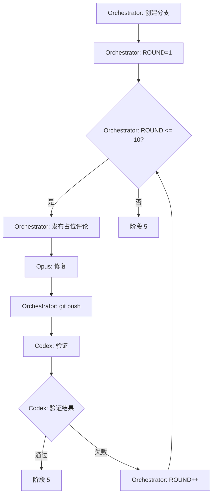

# 阶段 4: 修复验证（最多 10 轮）

**执行者**: Orchestrator + Opus + Codex



## 步骤 0: Orchestrator 创建修复分支

```bash
git checkout -b "bot🤖/pr-$PR_NUMBER"
ROUND=1
```

## 步骤 1: Orchestrator 发布占位评论

```bash
FIX_COMMENT_ID=$(scripts/post-comment.sh $PR_NUMBER $REPO "
<!-- duo-opus-fix-{ROUND} -->
##  Fix {ROUND} | Opus 4.5 | ✅ PR → ✅ Cross → ⏳ Fix

*正在修复问题...* 
")
```

## 步骤 2: Opus 修复

```plain
scripts/opus-resume.sh $OPUS_SESSION_ID "
## 读取交叉确认结论
gh pr view $PR_NUMBER --repo $REPO --json comments -q '[.comments[] | select(.body | contains(\"<!-- duo-\"))] | .[-4:][].body'

## 修复要求
- 只修复双方都认可（✅）的问题
- 保持最小改动
- commit message 格式：fix(duo): 修复内容
- 修复后执行 git add 和 git commit

## 输出
用 scripts/edit-comment.sh $FIX_COMMENT_ID 编辑占位评论（不要发新评论）。

评论格式：
<!-- duo-opus-fix-{ROUND} -->
##  Fix {ROUND} | Opus 4.5 | ✅ PR → ✅ Cross → ✅ Fix
> 🕐 时间：(scripts/get-time.sh)

### 修复内容
(描述你修复了什么)

### Commit
HASH=\$(git log -1 --format='%H')
[commit_message](https://github.com/\$REPO/commit/\$HASH)
"
```

## 步骤 3: Orchestrator 推送修复

```bash
git push origin "bot🤖/pr-$PR_NUMBER" --force
```

## 步骤 4: Codex 验证

```plain
scripts/codex-resume.sh $CODEX_SESSION_ID "
## 查看修复
git diff origin/$PR_BRANCH..HEAD

## 验证要点
- 问题是否真正解决
- 是否引入新问题
- 代码质量是否符合规范

## 输出
用 gh pr comment $PR_NUMBER --repo $REPO 发布验证结果。

评论格式：
<!-- duo-codex-verify-{ROUND} -->
##  Verify {ROUND} | GPT-5.1 Codex Max | ✅ PR → ✅ Cross → ✅ Fix → ⏳ Verify
> 🕐 时间：(scripts/get-time.sh)

### 验证结果
- ✅ 验证通过 - 修复正确且无新问题
- ❌ 验证失败 - (说明原因，Opus 将继续修复)
"
```

## 步骤 5: Orchestrator 判断

Orchestrator 读取 CODEX_RESULT，判断是否验证通过：
- 通过 → 退出循环，进入阶段 5
- 失败 → ROUND++，回到步骤 1

## 输出

- `VERIFIED`: true/false
- `FIX_BRANCH`: bot🤖/pr-$PR_NUMBER
- 下一阶段：5
