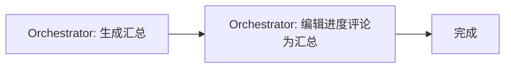

# 阶段 5: 汇总

**执行者**: Orchestrator



## 步骤 1: Orchestrator 生成汇总并编辑进度评论

将 `PROGRESS_COMMENT_ID` 的内容替换为最终汇总：

```bash
scripts/edit-comment.sh $PROGRESS_COMMENT_ID $REPO "
<!-- duo-review-summary -->
## 🔄 Duo Review 汇总

### 审查结论
- **Codex**: (一句话总结)
- **Opus**: (一句话总结)

### 交叉确认
(R1 达成共识 / 共 N 轮达成共识 / 共 N 轮仍有分歧)

### 结论
(✅ 无需修复 / ✅ 修复已验证通过 / ⚠️ 修复未验证通过)

修复分支：[bot🤖/pr-{PR_NUMBER}](https://github.com/{REPO}/compare/{PR_BRANCH}...bot🤖/pr-{PR_NUMBER})
"
```
