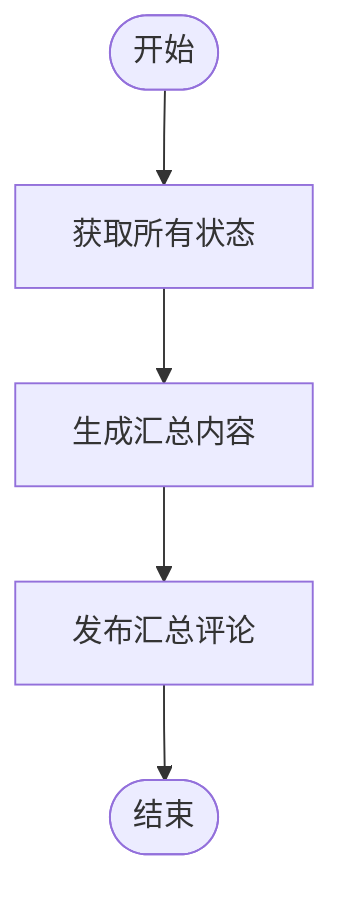

# 阶段 5: 汇总

**执行者**: Orchestrator

## 流程图



## 5.1 获取状态

```bash
$S/duo-set.sh $PR_NUMBER stage 5

RESULT=$($S/duo-get.sh $PR_NUMBER s2:result)
CODEX_CONCLUSION=$($S/duo-get.sh $PR_NUMBER s1:codex:conclusion)
OPUS_CONCLUSION=$($S/duo-get.sh $PR_NUMBER s1:opus:conclusion)
PROGRESS_ID=$($S/duo-get.sh $PR_NUMBER progress_comment)
CONSENSUS=$($S/duo-get.sh $PR_NUMBER s3:consensus)
NEED_FIX=$($S/duo-get.sh $PR_NUMBER s3:need_fix)
VERIFIED=$($S/duo-get.sh $PR_NUMBER s4:verified)
FIX_BRANCH=$($S/duo-get.sh $PR_NUMBER s4:branch)
```

## 5.2 根据情况生成汇总

### 情况 A: both_ok（双方都没发现问题）

```markdown
<!-- duo-review-summary -->
## ✅ Duo Review | PR #$PR_NUMBER

| Agent | 结论 |
|-------|------|
|  Codex | ✅ 未发现问题 |
|  Opus | ✅ 未发现问题 |

**结论**: 双方审查员均未发现问题，PR 可以合并。
```

### 情况 B: same_issues + 修复验证通过

```markdown
<!-- duo-review-summary -->
## ✅ Duo Review | PR #$PR_NUMBER

| Agent | 结论 |
|-------|------|
|  Codex | 发现问题 → ✅ 验证通过 |
|  Opus | 发现问题 → ✅ 已修复 |

**修复分支**: [`bot🤖/pr-$PR_NUMBER`](https://github.com/$REPO/compare/$PR_BRANCH...bot🤖/pr-$PR_NUMBER)

**结论**: 问题已修复并验证通过。
```

### 情况 C: divergent + 达成共识 + 修复

```markdown
<!-- duo-review-summary -->
## ✅ Duo Review | PR #$PR_NUMBER

| Agent | 结论 |
|-------|------|
|  Codex | $CODEX_CONCLUSION |
|  Opus | $OPUS_CONCLUSION |

**交叉确认**: 第 N 轮达成共识
**修复分支**: [`bot🤖/pr-$PR_NUMBER`](https://github.com/$REPO/compare/$PR_BRANCH...bot🤖/pr-$PR_NUMBER)

**结论**: 问题已修复并验证通过。
```

### 情况 D: divergent + 达成共识 + 无需修复

```markdown
<!-- duo-review-summary -->
## ✅ Duo Review | PR #$PR_NUMBER

| Agent | 结论 |
|-------|------|
|  Codex | $CODEX_CONCLUSION |
|  Opus | $OPUS_CONCLUSION |

**交叉确认**: 第 N 轮达成共识

**结论**: 经交叉确认，无需修复，PR 可以合并。
```

### 情况 E: 未达成共识或修复未验证

```markdown
<!-- duo-review-summary -->
## ⚠️ Duo Review | PR #$PR_NUMBER

| Agent | 结论 |
|-------|------|
|  Codex | $CODEX_CONCLUSION |
|  Opus | $OPUS_CONCLUSION |

**交叉确认**: 共 N 轮，未达成共识

**结论**: ⚠️ 需人工审查。请查看评论详情。
```

## 5.3 更新进度评论

```bash
echo "$SUMMARY_CONTENT" | $S/edit-comment.sh $PROGRESS_ID
```

## 清理

Redis 会在 2 小时后自动过期。
