# Duo Review - 双 Agent 交叉审查

## ⚠️ 启动检测

执行 `echo $RUNNER` 检测环境变量：

**有输出** → 脚本启动，跳过确认，直接执行阶段流程

**无输出** → 用户直接启动，进入交互模式：

1. 执行 `gh pr view --json number,baseRefName,headRefName` 获取 PR 信息
2. 向用户确认："检测到 PR #XX (head → base)，开始审查？"
3. 用户确认后执行：

   ```bash
   export RUNNER=droid
   ~/.factory/skills/duoduo/scripts/duo-run.sh $PR_NUMBER
   ```

4. 若检测不到 PR，询问用户输入 PR 编号

**⛔ 禁止**：如果 `duo-run.sh` 执行失败，**禁止**自己手动调用 `duo-init.sh` 或其他脚本来"修复"。直接报错并告知用户。

## 角色

| 角色             | 模型                | 职责                           |
| ---------------- | ------------------- | ------------------------------ |
| **Orchestrator** | 执行 skill 的 droid | 编排流程、判断共识、决定下一步 |
| **Codex**        | GPT-5.2             | PR 审查、交叉确认、验证修复    |
| **Opus**         | Claude Opus 4.5     | PR 审查、交叉确认、执行修复    |

## 通信架构


- **FIFO** = 数据通道（双向通信）
- **评论** = 纯 UI（给人看，不参与数据流）

## ⚠️ Orchestrator 行为规范

**禁止：**

- 读取 PR diff、REVIEW.md、代码文件
- 等待 Agent 时执行任何命令（FIFO 消息会丢失！）

**必须：**

- 启动 Agent 后直接回复"等待中..."然后结束回复
- Agent 结果会自动作为新消息发来：`<OPUS>...</OPUS>` / `<CODEX>...</CODEX>`

## 五阶段总览

```mermaid
flowchart TD
    Start([开始]) --> S1[阶段 1: 并行 PR 审查]
    S1 --> S2{阶段 2: 判断共识}
    
    S2 -->|both_ok| S5[阶段 5: 汇总]
    S2 -->|same_issues| S4[阶段 4: 修复验证]
    S2 -->|divergent| S3[阶段 3: 交叉确认]
    
    S3 -->|共识: 无需修复| S5
    S3 -->|共识: 需修复| S4
    S3 -->|5轮未达成| S5
    
    S4 -->|验证通过| S5
    S4 -->|5轮未通过| S5
    
    S5 --> End([结束])
```



## 输入

- `PR_NUMBER`: PR 编号
- `PR_BRANCH`: PR 分支名
- `BASE_BRANCH`: 目标分支
- `REPO`: 仓库名（格式 owner/repo）

## 脚本路径

```bash
S=~/.factory/skills/duoduo/scripts
```

## 可用脚本

| 脚本                 | 用途               | 用法                                                               |
| -------------------- | ------------------ | ------------------------------------------------------------------ |
| `$S/duo-init.sh`     | 初始化 Redis       | `$S/duo-init.sh $PR_NUMBER $REPO $PR_BRANCH $BASE_BRANCH [RUNNER]` |
| `$S/duo-set.sh`      | 设置状态           | `$S/duo-set.sh $PR_NUMBER <field> <value>`                         |
| `$S/duo-get.sh`      | 获取状态           | `$S/duo-get.sh $PR_NUMBER <field>`                                 |
| `$S/opus-start.py`   | 启动 Opus session  | `$S/opus-start.py $COMMENT_ID`                                     |
| `$S/codex-start.py`  | 启动 Codex session | `$S/codex-start.py $COMMENT_ID`                                    |
| `$S/fifo-send.sh`    | 给 session 发消息  | `$S/fifo-send.sh <orchestrator\|opus\|codex> $PR "<msg>"`          |
| `$S/post-comment.sh` | 发评论             | `$S/post-comment.sh $PR_NUMBER $REPO "<body>"`                     |
| `$S/edit-comment.sh` | 编辑评论           | `echo "<body>" \| $S/edit-comment.sh <comment_id>`                 |
| `$S/get-comment.sh`  | 读取评论           | `$S/get-comment.sh $PR_NUMBER $REPO <marker>`                      |
| `$S/duo-resume.sh`   | 恢复 session       | `$S/duo-resume.sh $PR_NUMBER <name>`                               |

## Redis 状态结构

```plain
Key: duo:{PR_NUMBER}

# 元信息（duo-init.sh 初始化）
repo, pr, branch, base, runner, stage, started_at

# Session 管理（session-start.py 自动写入）
orchestrator:session, orchestrator:fifo, orchestrator:pid, orchestrator:log
opus:session, opus:fifo, opus:pid, opus:log
codex:session, codex:fifo, codex:pid, codex:log

# 评论 ID（Orchestrator 写入，阶段 1 创建占位评论后保存）
s1:codex:comment_id
s1:opus:comment_id

# 阶段结果（Orchestrator 写入）
s2:result           both_ok | same_issues | divergent

# 阶段 4 状态（Opus 写入）
s4:branch           修复分支名（格式: duo/pr<PR>-<desc>）

# @Mention 状态（脚本初始化 idle，Orchestrator 完成后设置 done）
mention:status      idle | processing | done
```

## 阶段执行

**每个阶段执行前，必须先读取对应的 stages/ 文件获取详细指令！**

| 阶段 | 文件                          | 执行者               | 说明     |
| ---- | ----------------------------- | -------------------- | -------- |
| 1    | `stages/1-pr-review.md`       | Codex + Opus         | 并行审查 |
| 2    | `stages/2-judge-consensus.md` | Orchestrator         | 判断共识 |
| 3    | `stages/3-cross-confirm.md`   | Orchestrator + Agent | 交叉确认 |
| 4    | `stages/4-fix-verify.md`      | Opus + Codex         | 修复验证 |
| 5    | `stages/5-summary.md`         | Orchestrator         | 汇总     |

## 用户 @Mention 处理

当收到 `<USER_MENTION>` 消息时，表示用户通过 PR 评论 @mention 了 bot，需要与之交互。

### 消息格式

```xml
<USER_MENTION repo="owner/repo" pr="123" author="username">
用户的评论内容...
</USER_MENTION>
```

### 处理流程

1. **发布占位评论**（告知用户正在处理）：

   ```bash
   $S/duo-set.sh $PR_NUMBER mention:status processing
   
   TIMESTAMP=$(TZ='Asia/Shanghai' date '+%Y-%m-%d %H:%M')
   MENTION_COMMENT=$($S/post-comment.sh $PR_NUMBER $REPO "<!-- duo-mention-reply -->
   ## 🤖 Orchestrator 处理中
   > 🕐 $TIMESTAMP

   @$AUTHOR 收到消息，{随机ing词}...")
   ```

2. **读取 PR 所有评论**：

   ```bash
   gh pr view $PR_NUMBER --repo $REPO --json comments -q '.comments[].body'
   ```

3. **理解完整上下文**：
   - 之前的审查结果（Codex/Opus 的评论）
   - 修复记录（如有）
   - 用户的历史讨论

4. **着重处理用户最新消息**（`<USER_MENTION>` 中的内容）

5. **更新占位评论，告知用户决定**：

   ```bash
   echo "$REPLY_CONTENT" | $S/edit-comment.sh $MENTION_COMMENT
   ```

   **评论格式**（必须严格遵循）：

   ```markdown
   <!-- duo-mention-reply -->
   ## 🤖 Orchestrator 回复
   > 🕐 $TIMESTAMP
   
   @$AUTHOR {回复内容}
   
   {如需执行动作，说明下一步}
   ```

   示例：
   - "好的，我将重新发起审查..."
   - "我将与 Opus 沟通纠正这个问题..."
   - "针对你的问题：{回答内容}"

6. **执行动作并设置完成状态**：

   **整个交互完成后**（包括后续动作），设置：
   ```bash
   $S/duo-set.sh $PR_NUMBER mention:status done
   ```
   
   | 场景 | 何时设置 done |
   |------|---------------|
   | 直接回答 | 回复用户后 |
   | 重新审查 | 整个审查流程结束后（stage=done 后） |
   | 与 Agent 沟通 | 沟通完成并回复用户后 |

   **注意**：@Mention 场景下 Opus/Codex 可能已不存活，沟通前需检查并恢复：

   ```bash
   # 检查并恢复 Opus（如需与 Opus 沟通）
   OPUS_PID=$(redis-cli HGET "duo:$PR_NUMBER" opus:pid)
   if [ -z "$OPUS_PID" ] || ! kill -0 "$OPUS_PID" 2>/dev/null; then
     $S/duo-resume.sh $PR_NUMBER opus
   fi
   ```

   恢复后用 `$S/fifo-send.sh` 发送消息。

- `author`: 评论用户的 GitHub 用户名，用于 @ 回复

## 图标

```plain
Codex: 
Opus:  
Codex Loading: 
Opus Loading:  
```
