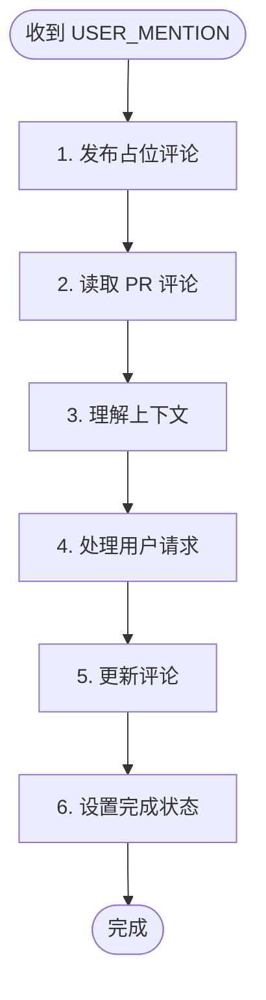

# 用户 @Mention 处理 - Orchestrator

收到 `<USER_MENTION>` 消息时，表示用户通过 PR 评论 @mention 了 bot。



---

## 消息格式

```xml
<USER_MENTION repo="owner/repo" pr="123" author="username">
用户的评论内容...
</USER_MENTION>
```

---

## 1. 发布占位评论

```bash
duo-cli set mention:status processing

TIMESTAMP=$(TZ='Asia/Shanghai' date '+%Y-%m-%d %H:%M')
MENTION_COMMENT=$(duo-cli comment post "<!-- duo-mention-reply -->
## 🤖 Orchestrator 处理中
> 🕐 $TIMESTAMP

@$AUTHOR 收到消息，{随机ing词}...")
```

---

## 2. 读取 PR 评论

```bash
gh pr view $PR_NUMBER --repo $REPO --json comments -q '.comments[].body'
```

---

## 3. 理解上下文

- 之前的审查结果（Codex/Opus 的评论）
- 修复记录（如有）
- 用户的历史讨论

---

## 4. 处理用户请求

着重处理 `<USER_MENTION>` 中的内容。

---

## 5. 更新评论

```bash
duo-cli comment edit $MENTION_COMMENT "$REPLY_CONTENT"
```

**评论格式：**

```markdown
<!-- duo-mention-reply -->
## 🤖 Orchestrator 回复
> 🕐 $TIMESTAMP

@$AUTHOR {回复内容}

{如需执行动作，说明下一步}
```

---

## 6. 设置完成状态

**整个交互完成后**设置：

```bash
duo-cli set mention:status done
```

| 场景          | 何时设置 done        |
| ------------- | -------------------- |
| 直接回答      | 回复用户后           |
| 重新审查      | 整个审查流程结束后   |
| 与 Agent 沟通 | 沟通完成并回复用户后 |

**注意**：Opus/Codex 可能已不存活，沟通前需恢复：

```bash
duo-cli resume opus
duo-cli send opus "..."
```
