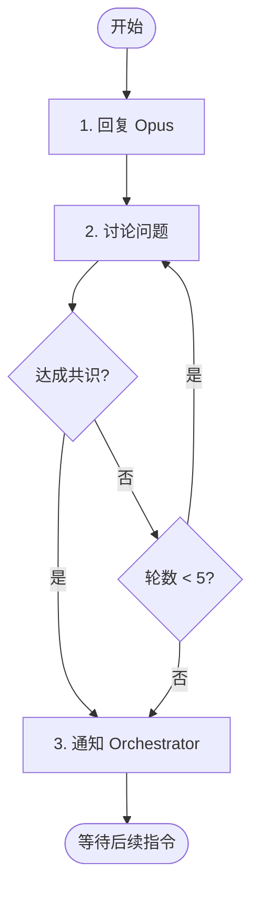

# 阶段 3: 交叉确认 - Codex

和 Opus 直接对话，对每个问题达成共识。



---

## 1. 回复 Opus

```bash
duo-cli send opus --stdin <<EOF
<MESSAGE from="codex" to="opus">
| 问题 | 我的判断 | 说明                 |
| ---- | -------- | -------------------- |
| O1   | 🔧 Fix    | 同意，确实有风险     |
| O2   | ⏭️ Skip   | 风格问题，不影响功能 |
| C1   | ⏭️ Skip   | 重新看了，确实不重要 |
</MESSAGE>
EOF

# 同时发布评论（给人看）
duo-cli comment post --stdin <<EOF
<!-- duo-cross-codex-r1 -->
##  Codex 交叉确认
> 🕐 $TIMESTAMP

| 问题 | 结论   | 说明     |
| ---- | ------ | -------- |
| O1   | 🔧 Fix  | 同意     |
| O2   | ⏭️ Skip | 风格问题 |
| C1   | ⏭️ Skip | 不重要   |
EOF
```

---

## 2. 讨论问题

对每个问题讨论并达成共识：

- 🔧 Fix - 确认需要修复
- ⏭️ Skip - 跳过（误报/不值得修复）

最多 5 轮对话。由 Opus 或你通知 Orchestrator。

---

## 3. 通知 Orchestrator

**达成共识：**

```bash
duo-cli send orchestrator --stdin <<EOF
<MESSAGE from="codex" to="orchestrator">
## 交叉确认完成

| 问题                   | 状态   | 说明          |
| ---------------------- | ------ | ------------- |
| O1 [P1] 空指针检查缺失 | 🔧 Fix  | 双方确认      |
| O2 日志格式不一致      | ⏭️ Skip | style only    |
| C1 变量命名不规范      | ⏭️ Skip | not important |
</MESSAGE>
EOF
```

**僵局：**

```bash
duo-cli send orchestrator --stdin <<EOF
<MESSAGE from="codex" to="orchestrator">
## 交叉确认结束（僵局）

| 问题 | 状态       | 说明                         |
| ---- | ---------- | ---------------------------- |
| O1   | 🔧 Fix      | 双方确认                     |
| O2   | ⚠️ Deadlock | Opus: 需修复 / Codex: 不需要 |
</MESSAGE>
EOF
```
