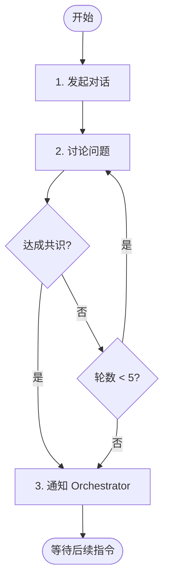

# 阶段 3: 交叉确认 - Opus

和 Codex 直接对话，对每个问题达成共识。



---

## 1. 发起对话

```bash
duo-cli send codex --stdin <<EOF
我发现了 2 个问题，你发现了 1 个。让我们逐个确认：

O1. [P1] 空指针检查缺失 - 我认为需要修复
O2. [P2] 日志格式不一致 - 建议修复
C1. [P3] 变量命名不规范 - 你怎么看？

阅读 ~/.factory/skills/duoduo/stages/3-cross-confirm-codex.md 执行。
EOF

# 同时发布评论（给人看）
duo-cli comment post --stdin <<EOF
<!-- duo-cross-opus-r1 -->
##  Opus 交叉确认
> 🕐 $TIMESTAMP

| 问题 | 结论 | 说明     |
| ---- | ---- | -------- |
| O1   | 🔧?   | 等待确认 |
| O2   | 🔧?   | 等待确认 |
| C1   | ?    | 等待讨论 |
EOF
```

---

## 2. 讨论问题

对每个问题讨论并达成共识：

- 🔧 Fix - 确认需要修复
- ⏭️ Skip - 跳过（误报/不值得修复）

最多 5 轮对话。

---

## 3. 通知 Orchestrator

**达成共识：**

```bash
duo-cli send orchestrator --stdin <<EOF
## 交叉确认完成

| 问题                   | 状态   | 说明          |
| ---------------------- | ------ | ------------- |
| O1 [P1] 空指针检查缺失 | 🔧 Fix  | 双方确认      |
| O2 日志格式不一致      | ⏭️ Skip | style only    |
| C1 变量命名不规范      | ⏭️ Skip | not important |
EOF
```

**僵局：**

```bash
duo-cli send orchestrator --stdin <<EOF
## 交叉确认结束（僵局）

| 问题 | 状态       | 说明                         |
| ---- | ---------- | ---------------------------- |
| O1   | 🔧 Fix      | 双方确认                     |
| O2   | ⚠️ Deadlock | Opus: 需修复 / Codex: 不需要 |
EOF
```
