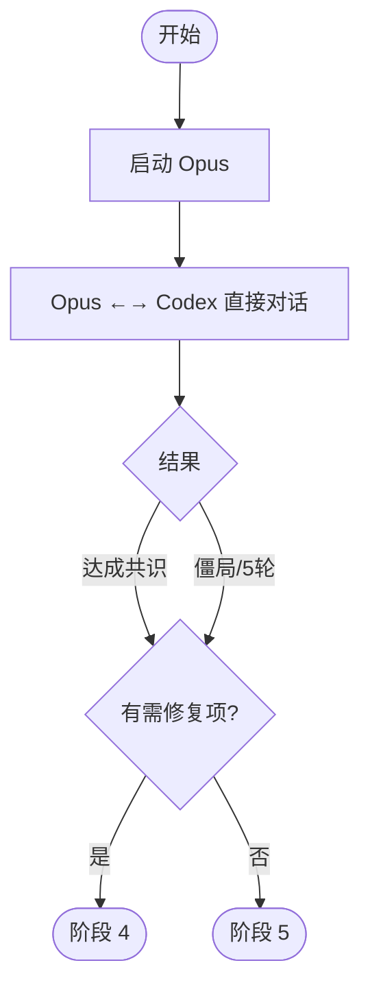

# 阶段 3: 交叉确认 - Orchestrator

## 概述

启动交叉确认，让 Opus 和 Codex 直接对话达成共识。



## 执行

只启动 Opus。Codex 由 Opus 消息触发。

```bash
duo-cli set stage 3

duo-cli send opus --stdin <<EOF
## 交叉确认任务

你需要和 Codex 直接对话，确认以下问题：

### Opus 发现
$OPUS_FINDINGS

### Codex 发现
$CODEX_FINDINGS

阅读 ~/.factory/skills/duoduo/stages/3-cross-confirm-opus.md 执行。
EOF
```

## 等待

启动后等待 FIFO 消息。收到共识结果后：

- 有 Fix 问题 → 阶段 4
- 全部 Skip → 阶段 5
- 有 Deadlock → 阶段 5（标记需人工审查）
