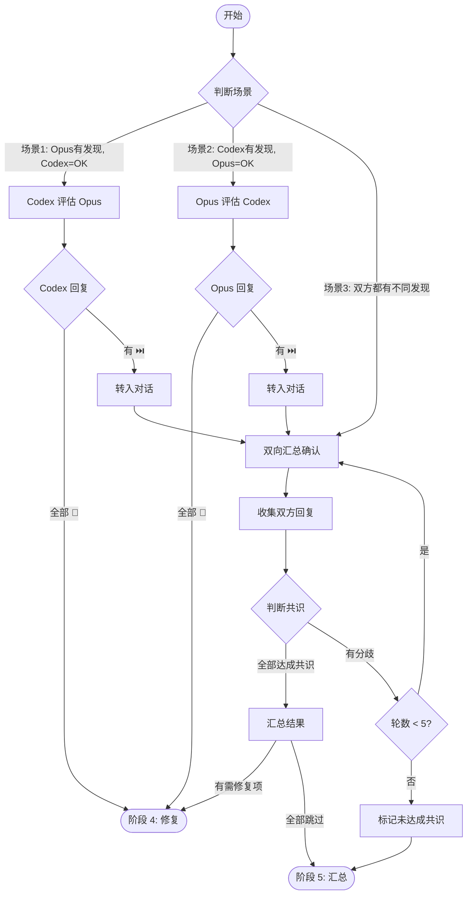

# 阶段 3: 交叉确认

**执行者**: Orchestrator

## 流程图



## 3.1 初始化

```bash
$S/duo-set.sh $PR_NUMBER stage 3
$S/duo-set.sh $PR_NUMBER s3:round 1
```

## 3.2 判断场景

Orchestrator 根据阶段 1 收到的结果判断：

| 场景 | Opus   | Codex          | 处理方式                 |
| ---- | ------ | -------------- | ------------------------ |
| 1    | 有发现 | OK             | 单向：Codex 评估 Opus    |
| 2    | OK     | 有发现         | 单向：Opus 评估 Codex    |
| 3    | 有发现 | 有发现（不同） | 双向：汇总后双方 confirm |

---

## 场景 1: Codex 评估 Opus（单向）

Opus 有发现，Codex 说 OK。

### 发送给 Codex

```bash
$S/fifo-send.sh codex $PR_NUMBER "
## 你是 Codex，任务：评估 Opus 的发现

Opus 在 PR #$PR_NUMBER 中发现了以下问题：

<opus-findings>
$OPUS_FINDINGS
</opus-findings>

请逐条评估：
- 🔧 Fix - 确认是问题，需要修复
- ⏭️ Skip - 跳过（误报/不值得修复）

## 输出格式（必须严格遵循）

先获取时间戳：TIMESTAMP=\$(TZ='Asia/Shanghai' date '+%Y-%m-%d %H:%M')

评论内容必须是：
<!-- duo-cross-codex-r1 -->
##  Codex 交叉确认 | Round 1
> 🕐 \$TIMESTAMP

| 问题 | 结论 | 说明 |
|------|------|------|
| O1   | 🔧/⏭️ | ...  |
| O2   | 🔧/⏭️ | ...  |

**总结**: (一句话总结)

## 完成后
1. \$S/post-comment.sh \$PR_NUMBER \$REPO \"\$COMMENT_CONTENT\"
2. \$S/fifo-send.sh orchestrator $PR_NUMBER '<CODEX>评论内容</CODEX>'
"
```

### Orchestrator 处理回复

收到 Codex 回复后：
- 全部 🔧 → 共识达成，进入阶段 4
- 有 ⏭️ → 把 Codex 的理由转发给 Opus，转入场景 3（双向确认）

---

## 场景 2: Opus 评估 Codex（单向）

Codex 有发现，Opus 说 OK。

### 发送给 Opus

```bash
$S/fifo-send.sh opus $PR_NUMBER "
## 你是 Opus，任务：评估 Codex 的发现

Codex 在 PR #$PR_NUMBER 中发现了以下问题：

<codex-findings>
$CODEX_FINDINGS
</codex-findings>

请逐条评估：
- 🔧 Fix - 确认是问题，需要修复
- ⏭️ Skip - 跳过（误报/不值得修复）

## 输出格式（必须严格遵循）

先获取时间戳：TIMESTAMP=\$(TZ='Asia/Shanghai' date '+%Y-%m-%d %H:%M')

评论内容必须是：
<!-- duo-cross-opus-r1 -->
##  Opus 交叉确认 | Round 1
> 🕐 \$TIMESTAMP

| 问题 | 结论 | 说明 |
|------|------|------|
| C1   | 🔧/⏭️ | ...  |
| C2   | 🔧/⏭️ | ...  |

**总结**: (一句话总结)

## 完成后
1. \$S/post-comment.sh \$PR_NUMBER \$REPO \"\$COMMENT_CONTENT\"
2. \$S/fifo-send.sh orchestrator $PR_NUMBER '<OPUS>评论内容</OPUS>'
"
```

### Orchestrator 处理回复

收到 Opus 回复后：
- 全部 🔧 → 共识达成，进入阶段 4
- 有 ⏭️ → 转入场景 3（双向确认）

---

## 场景 3: 双向汇总确认

双方都有发现但不同，或单向评估后仍有分歧。

### 发送给 Opus

```bash
$S/fifo-send.sh opus $PR_NUMBER "
## 你是 Opus

## 待确认问题列表（Round $ROUND）

### Opus 发现
O1. [P1] $OPUS_FINDING_1
O2. [P2] $OPUS_FINDING_2

### Codex 发现
C1. [P1] $CODEX_FINDING_1
C2. [P3] $CODEX_FINDING_2

请逐条评估所有问题（包括你自己的和 Codex 的）：
- 🔧 Fix - 确认是问题，需要修复
- ⏭️ Skip - 跳过（误报/不值得修复）

## 输出格式（必须严格遵循）

先获取时间戳：TIMESTAMP=\$(TZ='Asia/Shanghai' date '+%Y-%m-%d %H:%M')

评论内容必须是：
<!-- duo-cross-opus-r$ROUND -->
##  Opus 交叉确认 | Round $ROUND
> 🕐 \$TIMESTAMP

| 问题 | 结论 | 说明 |
|------|------|------|
| O1   | 🔧/⏭️ | ...  |
| O2   | 🔧/⏭️ | ...  |
| C1   | 🔧/⏭️ | ...  |
| C2   | 🔧/⏭️ | ...  |

**总结**: (一句话总结)

## 完成后
1. \$S/post-comment.sh \$PR_NUMBER \$REPO \"\$COMMENT_CONTENT\"
2. \$S/fifo-send.sh orchestrator $PR_NUMBER '<OPUS>评论内容</OPUS>'
"
```

### 发送给 Codex

```bash
$S/fifo-send.sh codex $PR_NUMBER "
## 你是 Codex

## 待确认问题列表（Round $ROUND）

### Opus 发现
O1. [P1] $OPUS_FINDING_1
O2. [P2] $OPUS_FINDING_2

### Codex 发现
C1. [P1] $CODEX_FINDING_1
C2. [P3] $CODEX_FINDING_2

请逐条评估所有问题（包括你自己的和 Opus 的）：
- 🔧 Fix - 确认是问题，需要修复
- ⏭️ Skip - 跳过（误报/不值得修复）

## 输出格式（必须严格遵循）

先获取时间戳：TIMESTAMP=\$(TZ='Asia/Shanghai' date '+%Y-%m-%d %H:%M')

评论内容必须是：
<!-- duo-cross-codex-r$ROUND -->
##  Codex 交叉确认 | Round $ROUND
> 🕐 \$TIMESTAMP

| 问题 | 结论 | 说明 |
|------|------|------|
| O1   | 🔧/⏭️ | ...  |
| O2   | 🔧/⏭️ | ...  |
| C1   | 🔧/⏭️ | ...  |
| C2   | 🔧/⏭️ | ...  |

**总结**: (一句话总结)

## 完成后
1. \$S/post-comment.sh \$PR_NUMBER \$REPO \"\$COMMENT_CONTENT\"
2. \$S/fifo-send.sh orchestrator $PR_NUMBER '<CODEX>评论内容</CODEX>'
"
```

### 收集双方回复

等待双方都回复后，Orchestrator 判断每个问题的共识：

```plain
收到：
Opus:   O1:🔧  O2:🔧  C1:⏭️(理由A)  C2:🔧
Codex:  O1:🔧  O2:⏭️(理由B)  C1:🔧  C2:🔧

判断：
O1: 双方 🔧 → 达成共识，需修复
O2: Opus🔧 Codex⏭️ → 分歧
C1: Opus⏭️ Codex🔧 → 分歧
C2: 双方 🔧 → 达成共识，需修复
```

### 共识判断逻辑

| Opus | Codex | 结果 |
|------|-------|------|
| 🔧 | 🔧 | ✅ 共识：修复 |
| ⏭️ | ⏭️ | ✅ 共识：跳过 |
| 🔧 | ⏭️ | ❌ 分歧 → 下一轮 |
| ⏭️ | 🔧 | ❌ 分歧 → 下一轮 |

### Round 2+: 针对分歧项继续确认

如果仍有分歧，Orchestrator 汇总分歧项和双方理由，分别发送给双方（格式同上，更新问题列表为分歧项）。

### 循环终止条件

1. **全部达成共识** - 所有问题双方结论一致
   - 有 🔧 项 → 阶段 4
   - 全部 ⏭️ → 阶段 5

2. **达到轮数上限（5 轮）** - 仍有分歧 → 阶段 5（标记需人工审查）

---

**重要**：交叉确认评论必须用 `post-comment.sh` 发新评论，形成对话流。不要用 `edit-comment.sh` 更新原评论。
