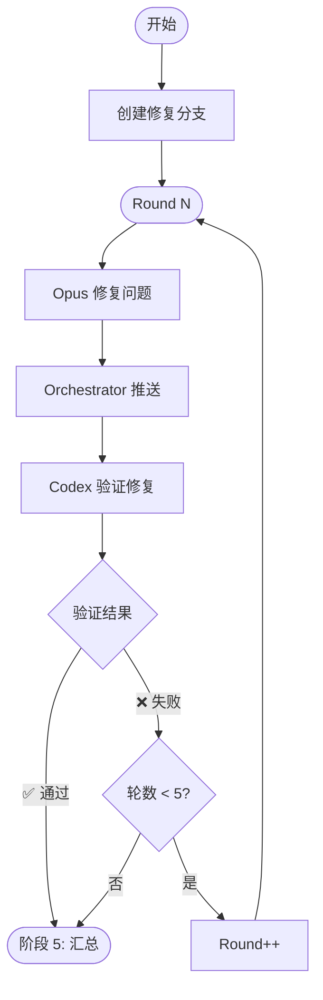

# 阶段 4: 修复验证（最多 5 轮）

**执行者**: Orchestrator + Opus + Codex

## 流程图



## 4.1 初始化

```bash
$S/duo-set.sh $PR_NUMBER stage 4
$S/duo-set.sh $PR_NUMBER s4:round 1

# 创建修复分支（-B 强制覆盖已存在的同名分支）
git checkout -B "bot/pr-$PR_NUMBER" "$PR_BRANCH"
```

---

## 循环（ROUND <= 5）

### 4.2 创建修复占位评论

```bash
TIMESTAMP=$(TZ='Asia/Shanghai' date '+%Y-%m-%d %H:%M')

OPUS_FIX_COMMENT=$($S/post-comment.sh $PR_NUMBER $REPO "<!-- duo-opus-fix -->
##  Opus 修复中
> 🕐 $TIMESTAMP

 {随机ing词}...")

$S/duo-set.sh $PR_NUMBER s4:opus:comment_id $OPUS_FIX_COMMENT
```

**{随机 ing 词}**: 自己想一个 -ing 结尾的词或短语。

### 4.3 启动 Opus 修复

```bash
ROUND=$($S/duo-get.sh $PR_NUMBER s4:round)
OPUS_FIX_COMMENT=$($S/duo-get.sh $PR_NUMBER s4:opus:comment_id)

$S/fifo-send.sh opus $PR_NUMBER "
## 任务
读取 PR 评论中双方都标记为 🔧 Fix 的问题，进行修复。

## 要求
- 只修复达成共识的问题
- 保持最小改动
- commit message: fix(duo): 简要描述

## 完成后
1. git add -A && git commit -m 'fix(duo): ...'
2. 更新占位评论（用 edit-comment.sh）:
   echo '\$COMMENT_CONTENT' | \$S/edit-comment.sh $OPUS_FIX_COMMENT
3. 发回结果给 Orchestrator:
   \$S/fifo-send.sh orchestrator $PR_NUMBER '<OPUS>\$COMMENT_CONTENT</OPUS>'

### 评论格式（必须严格遵循）

先获取时间戳：TIMESTAMP=\$(TZ='Asia/Shanghai' date '+%Y-%m-%d %H:%M')

<!-- duo-opus-fix -->
##  Opus 修复完成
> 🕐 \$TIMESTAMP

### 修复内容
**Commit**: [\`<short_hash>\`](https://github.com/$REPO/commit/<full_hash>)

(说明修复了什么问题)

### 文件变更
(列出修改的文件及行数变更)
"
```

### 4.4 推送修复

```bash
BRANCH=$($S/duo-get.sh $PR_NUMBER s4:branch)
git push origin "$BRANCH" --force
```

### 4.5 创建验证占位评论

```bash
TIMESTAMP=$(TZ='Asia/Shanghai' date '+%Y-%m-%d %H:%M')

CODEX_VERIFY_COMMENT=$($S/post-comment.sh $PR_NUMBER $REPO "<!-- duo-codex-verify -->
##  Codex 验证中
> 🕐 $TIMESTAMP

 {随机ing词}...")

$S/duo-set.sh $PR_NUMBER s4:codex:comment_id $CODEX_VERIFY_COMMENT
```

**{随机 ing 词}**: 自己想一个 -ing 结尾的词或短语。

### 4.6 启动 Codex 验证

```bash
CODEX_VERIFY_COMMENT=$($S/duo-get.sh $PR_NUMBER s4:codex:comment_id)

$S/fifo-send.sh codex $PR_NUMBER "
## 任务
验证 Opus 的修复是否正确。

## 步骤
git diff origin/$PR_BRANCH..HEAD

## 检查项
1. 问题是否真正解决
2. 是否引入新问题
3. 代码质量是否符合规范

## 完成后
1. 更新占位评论（用 edit-comment.sh）:
   echo '\$COMMENT_CONTENT' | \$S/edit-comment.sh $CODEX_VERIFY_COMMENT
2. 发回结果给 Orchestrator:
   \$S/fifo-send.sh orchestrator $PR_NUMBER '<CODEX>\$COMMENT_CONTENT</CODEX>'

### 评论格式（必须严格遵循）

先获取时间戳：TIMESTAMP=\$(TZ='Asia/Shanghai' date '+%Y-%m-%d %H:%M')

<!-- duo-codex-verify -->
##  Codex 验证完成
> 🕐 \$TIMESTAMP

### 验证结果
(✅ 通过 / ❌ 失败 + 原因)
"
```

### 4.7 判断结果

```bash
VERIFIED=$($S/duo-get.sh $PR_NUMBER s4:verified)
ROUND=$($S/duo-get.sh $PR_NUMBER s4:round)

if [ "$VERIFIED" = "1" ]; then
  # 验证通过 → 阶段 5
  echo "修复验证通过"
  
elif [ "$ROUND" -ge 5 ]; then
  # 达到最大轮数 → 阶段 5
  echo "达到最大轮数"
  
else
  # 验证失败，继续下一轮
  $S/duo-set.sh $PR_NUMBER s4:opus:status pending
  $S/duo-set.sh $PR_NUMBER s4:codex:status pending
  $S/duo-set.sh $PR_NUMBER s4:round $((ROUND + 1))
  # → 继续循环
fi
```

---

## 退出条件

1. `s4:verified = 1` → 阶段 5（修复成功）
2. `s4:round > 10` → 阶段 5（标记修复未完成）
