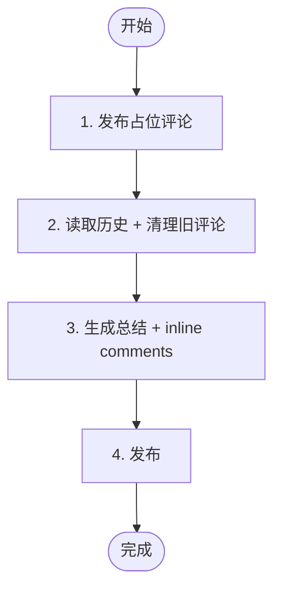

# 阶段 5: 汇总 - Orchestrator

生成最终汇总评论，结束审查流程。



---

## 1. 发布占位评论

```bash
duo-cli set stage 5
TIMESTAMP=$(TZ='Asia/Shanghai' date '+%Y-%m-%d %H:%M')
RUNNER=$(duo-cli get runner)
ORCHESTRATOR_SESSION=$(duo-cli get orchestrator:session)
OPUS_SESSION=$(duo-cli get opus:session)
CODEX_SESSION=$(duo-cli get codex:session)

COMMENT_ID=$(duo-cli comment post --stdin <<EOF
<!-- duo-summary -->
## ⏳ Duo Review Summary
> 🕐 $TIMESTAMP

正在生成总结...
EOF
)
```

---

## 2. 读取历史 + 清理旧评论

### 读取历史

从消息历史和评论中理解整个审查过程：

```bash
duo-cli messages --last 50
duo-cli comment list
```

### 清理旧评论

删除 Agent 的审查评论和自己的占位评论：

```bash
# 删除所有 Agent 评论和旧的总结
# duo-opus-r1, duo-codex-r1 (阶段1)
# duo-cross-opus-r1, duo-cross-codex-r1 (阶段3)
# duo-opus-fix, duo-codex-verify (阶段4)
# duo-summary (阶段5 占位/旧总结)
duo-cli comment list | grep -E 'duo-(opus|codex|cross|summary)' | awk '{print $2}' | xargs -I {} duo-cli comment delete {} -y
```

---

## 3. 生成总结 + inline comments

**注意**：仅在此阶段允许读取代码，用于理解最终 findings 并确定 inline comments 的 path 和 line。

```bash
git diff origin/$DROID_BASE...HEAD
```

### 3.1 生成总结内容

根据步骤 2 收集的历史信息生成 `$SUMMARY_CONTENT`。

**模板：**

```markdown
<!-- duo-summary -->
## {✅|⚠️} Duo Review Summary
> 🕐 $TIMESTAMP

### 审查时间线

| 时间 (UTC+8) | 事件                                          |
| ------------ | --------------------------------------------- |
| MM-DD HH:MM  | Round 1 启动 - Opus & Codex 并行审查 {branch} |
| MM-DD HH:MM  | Opus 发现 [P0] ... / Opus 未发现问题          |
| MM-DD HH:MM  | Codex 发现 [P0] ... / Codex 未发现问题        |
| MM-DD HH:MM  | 交叉验认 - {双方问题均为发现 / 存在分歧}      |
| MM-DD HH:MM  | 共识: {结论}                                  |
| MM-DD HH:MM  | Opus 修复: {描述}                             |
| MM-DD HH:MM  | Codex 验证通过 / 验证失败                     |
| MM-DD HH:MM  | ✅ 审查完成                                    |

{如有 findings:}
### 审查发现

| #   | 问题       | 状态              |
| --- | ---------- | ----------------- |
| 1   | 🔴 [P0] ... | ✅ 已修复 / ⏭️ 跳过 |

{可选: 修复分支链接}

### 审查结论
| Agent                                                                                                   | 结论   |
| ------------------------------------------------------------------------------------------------------- | ------ |
|  Codex      | {结论} |
|  Opus | {结论} |

**结论**: {一句话总结}

<details>
<summary>Session Info</summary>

- Runner: `$RUNNER`
- Orchestrator: `$ORCHESTRATOR_SESSION`
- Opus: `$OPUS_SESSION`
- Codex: `$CODEX_SESSION`
</details>
```

### 3.2 生成 inline comments（如有确认的 findings）

针对交叉确认后的最终 findings（排除误报），生成 JSON 数组。

**JSON 格式：**

| 字段         | 必填 | 说明                               |
| ------------ | ---- | ---------------------------------- |
| `path`       | ✅    | 文件路径（相对仓库根目录）         |
| `line`       | ✅    | 结束行号（PR diff 中的新文件行号） |
| `start_line` | ❌    | 起始行号（多行时需要，单行时省略） |
| `body`       | ✅    | 评论内容（见下方模板）             |

**注意**：行号必须在 PR diff 的变更范围内（新增或修改的行），否则 API 会报错。

**Body 模板：**

```markdown
**<sub><sub></sub></sub>  {标题}**

{问题描述}

Useful? React with 👍 / 👎.
```

**问题描述要求**：1-2 段，说明为什么是问题、影响是什么、如何修复的。

**Badge URLs：**

| 级别 | URL                                                 |
| ---- | --------------------------------------------------- |
| P0   | `https://img.shields.io/badge/P0-red?style=flat`    |
| P1   | `https://img.shields.io/badge/P1-orange?style=flat` |
| P2   | `https://img.shields.io/badge/P2-yellow?style=flat` |
| P3   | `https://img.shields.io/badge/P3-green?style=flat`  |

**示例：**

```json
[
  {
    "path": "src/example.py",
    "start_line": 10,
    "line": 12,
    "body": "**<sub><sub></sub></sub>  变量未初始化**\n\n当 timeout 时 `result` 未赋值，后续访问会抛出异常。\n\nUseful? React with 👍 / 👎."
  }
]
```

---

## 4. 发布

### 有双方共识的 findings：用 Review + inline comments

```bash
duo-cli review post --body "$SUMMARY_CONTENT" --stdin <<'EOF'
[... inline comments JSON ...]
EOF

duo-cli set stage done
```

### 无双方共识的 findings 时：用 Comment

以下情况使用 comment：
- both_ok（双方都未发现问题）
- 所有 findings 均为共识跳过或分歧跳过

```bash
duo-cli comment post --stdin <<EOF
$SUMMARY_CONTENT
EOF

duo-cli set stage done
```
